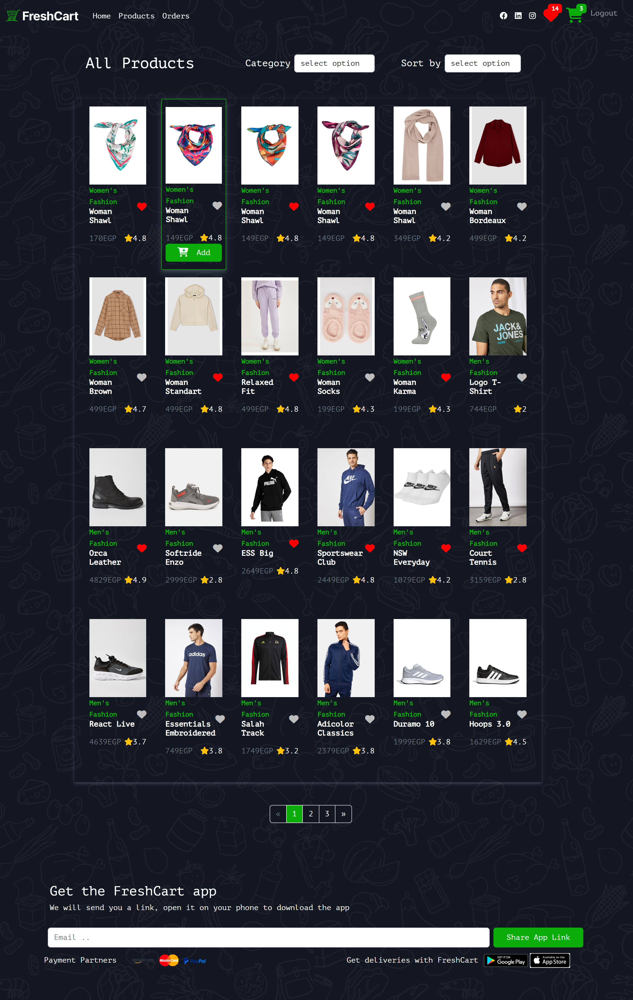

# Fresh Cart
freshCart is a modern e-commerce application built with React, offering a seamless and intuitive shopping experience. With a focus on user experience and performance, freshCart provides all the essential features to manage your online shopping needs effectively.
## Features
- **User Authentication**: Secure user registration and login system to protect user data and provide personalized experiences.
- **Product Browsing**: Browse through a wide range of products with advanced filtering, sorting, and pagination to easily find the desired items.
- **Product Details**: Detailed product pages with high-quality images, descriptions, and user reviews to assist in making informed purchasing decisions.
- **Shopping Cart**: A fully functional shopping cart that allows users to add, remove, and update items before proceeding to checkout.
- **Responsive Design**: Ensures a consistent and user-friendly experience across various devices, from desktops to mobile phones.
- **Checkout Process**: A streamlined and secure checkout process, including payment options, shipping information, and order confirmation.
- **Order Tracking**: Allows users to track the status of their orders from processing to delivery.
- **SEO Optimization**: Implemented with react-helmet to manage meta tags and improve the site's SEO performance.
# Getting Started with Create React App

This project was bootstrapped with [Create React App](https://github.com/facebook/create-react-app).

## Available Scripts

In the project directory, you can run:

### `npm start`

Runs the app in the development mode.\
Open [http://localhost:3000](http://localhost:3000) to view it in your browser.

The page will reload when you make changes.\
You may also see any lint errors in the console.

### `npm test`

Launches the test runner in the interactive watch mode.\
See the section about [running tests](https://facebook.github.io/create-react-app/docs/running-tests) for more information.

### `npm run build`

Builds the app for production to the `build` folder.\
It correctly bundles React in production mode and optimizes the build for the best performance.

The build is minified and the filenames include the hashes.\
Your app is ready to be deployed!

See the section about [deployment](https://facebook.github.io/create-react-app/docs/deployment) for more information.

### `npm run eject`

**Note: this is a one-way operation. Once you `eject`, you can't go back!**

If you aren't satisfied with the build tool and configuration choices, you can `eject` at any time. This command will remove the single build dependency from your project.

Instead, it will copy all the configuration files and the transitive dependencies (webpack, Babel, ESLint, etc) right into your project so you have full control over them. All of the commands except `eject` will still work, but they will point to the copied scripts so you can tweak them. At this point you're on your own.

You don't have to ever use `eject`. The curated feature set is suitable for small and middle deployments, and you shouldn't feel obligated to use this feature. However we understand that this tool wouldn't be useful if you couldn't customize it when you are ready for it.
## project view

  
  
  
  
  
  
  

## Learn More

You can learn more in the [Create React App documentation](https://facebook.github.io/create-react-app/docs/getting-started).

To learn React, check out the [React documentation](https://reactjs.org/).

### Code Splitting

This section has moved here: [https://facebook.github.io/create-react-app/docs/code-splitting](https://facebook.github.io/create-react-app/docs/code-splitting)

### Analyzing the Bundle Size

This section has moved here: [https://facebook.github.io/create-react-app/docs/analyzing-the-bundle-size](https://facebook.github.io/create-react-app/docs/analyzing-the-bundle-size)

### Making a Progressive Web App

This section has moved here: [https://facebook.github.io/create-react-app/docs/making-a-progressive-web-app](https://facebook.github.io/create-react-app/docs/making-a-progressive-web-app)

### Advanced Configuration

This section has moved here: [https://facebook.github.io/create-react-app/docs/advanced-configuration](https://facebook.github.io/create-react-app/docs/advanced-configuration)

### Deployment

This section has moved here: [https://facebook.github.io/create-react-app/docs/deployment](https://facebook.github.io/create-react-app/docs/deployment)

### `npm run build` fails to minify

This section has moved here: [https://facebook.github.io/create-react-app/docs/troubleshooting#npm-run-build-fails-to-minify](https://facebook.github.io/create-react-app/docs/troubleshooting#npm-run-build-fails-to-minify)
## Additional Information

**Social Media Links**: Connect with us on social media for more updates and food inspiration. Follow us on [Facebook](https://www.facebook.com/aljnrlabdullah.aljnrlabdullah) -facebook profile and [Instagram](https://www.instagram.com/abdllah_maher00/) - instagrm profile.

## Contact

For any questions or feedback, please contact me at ma4968867@gmail.com.

